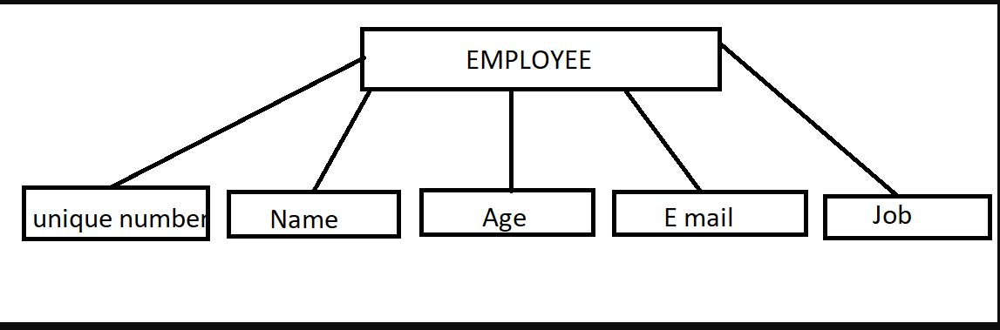
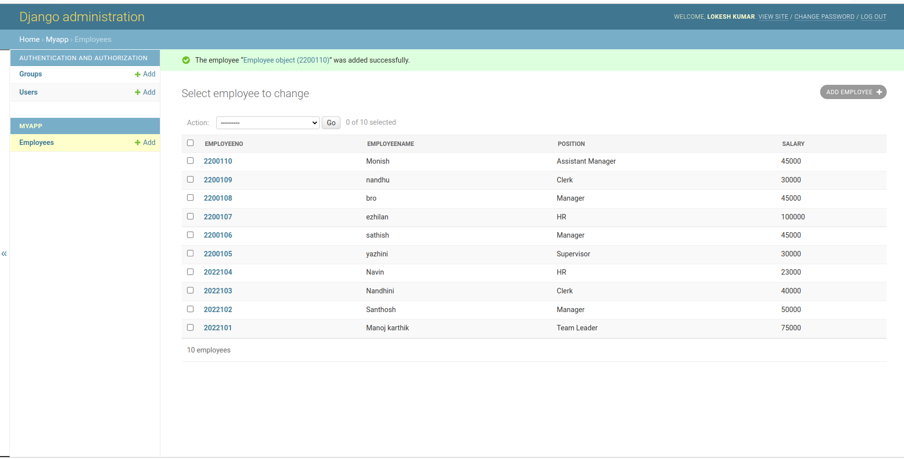

# Django ORM Web Application

## AIM
To develop a Django application to store and retrieve data from a database using Object Relational Mapping(ORM).

## Entity Relationship Diagram

## DESIGN STEPS

### STEP 1:

Create a new Django project using "django-admin startproject", get into the project
terminal and use "python3 manage.py startapp"command.

### STEP 2:

Define a model for the students_marks in the models.py. Allow host access and add
the app name under installed apps in settings.py

### STEP 3:

Register the models with the Django admin site. In admin.py under app folder,
register the models with Django admin site.
Firefox https://github.com/Jaiganesh235/django-orm-app/blob...
1 of 3 18/12/22, 12:38

### STEP 4:

Run the python manage.py makemigrations and python manage.py migrate
commands to create the necessary database tables for the student_marks model.
Run the server using "python3 manage.py runserver 0:80" command.

## PROGRAM

admin.py :

from django.contrib import admin
from .models import Employee,EmployeeAdmin
#Register your models here
admin.site.register(Employee,EmployeeAdmin)

models.py :

from django.db import models
from django.contrib import admin
# Create your models here.
class Employee(models.Model):

    Employeeno=models.IntegerField(primary_key=True)
    Employeename=models.CharField(max_length=100)
    position=models.CharField(max_length=100)
    salary=models.IntegerField()

class EmployeeAdmin(admin.ModelAdmin):
    list_display=('Employeeno','Employeename','position','salary',)

## OUTPUT

## RESULT
